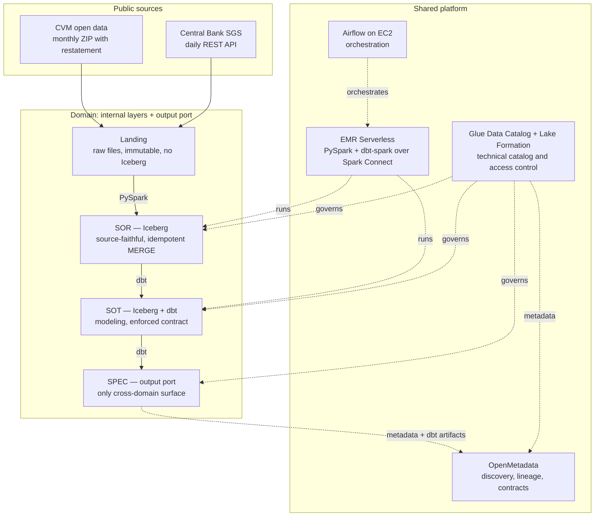

# emr-data-platform

Domain-oriented data platform on AWS: Iceberg lakehouse layers, EMR Serverless processing,
dbt transformations, Airflow orchestration, and federated governance through Lake Formation
and OpenMetadata.

All infrastructure is provisioned with Terraform.

## Architecture



Layers are **internal to a domain**. SPEC is the only surface crossable between domains.

## Domains

| Domain | Source | Nature |
|---|---|---|
| `macro` | Central Bank — SGS time series | REST API, low volume, append |
| `fundos` | CVM — investment fund daily report | monthly ZIP, restatement, MERGE |

`fundos` consumes the `macro` output port (SPEC). Never its SOR or SOT.

## Layers

| Layer | Format | Content |
|---|---|---|
| Landing | raw file (JSON/CSV/ZIP/PDF) | immutable, byte-faithful to what was received |
| SOR | Iceberg | source-faithful, typed, idempotent MERGE |
| SOT | Iceberg | modeling and business rules (dbt) |
| SPEC | Iceberg | data product, enforced contract, `access: public` |

## Naming convention

| Resource | Pattern | Example |
|---|---|---|
| Bucket | `edp-<domain>-<layer>-<env>-<account>-<region>-an` | `edp-macro-sor-dev-123456789012-us-east-1-an` |
| Glue database | `<domain>_<layer>_<env>` | `macro_sor_dev` |
| IAM role | `edp-<scope>-<env>-role` | `edp-emr-exec-dev-role` |
| EMR application | `edp-spark-<env>` | `edp-spark-dev` |
| State key | `edp/<env>/<stack>/terraform.tfstate` | `edp/dev/platform/terraform.tfstate` |

Buckets use the **S3 account regional namespace** (`-an` suffix), so no other account can
claim the name after a `destroy`. See [ADR-0004](docs/adr/0004-s3-account-regional-namespace.md).

## Repository layout

```
bootstrap/        state bucket + lock table (local state, runs once)
infra/modules/    Terraform modules (platform and domain)
infra/envs/       per-environment composition (dev, hom, prod)
jobs/             PySpark: Landing extraction and SOR load
dbt/              dbt projects per domain (SOT and SPEC)
airflow/dags/     orchestration DAGs
docs/adr/         architecture decision records (MADR 4.0)
scripts/          Spark Connect session and ODCS helpers
```

## Environments

`dev`, `hom`, and `prod` run in a single AWS account with **logical** isolation: separate
buckets, databases, roles, and LF-Tags per environment, and separate Terraform state per
directory. See [ADR-0002](docs/adr/0002-single-account-logical-isolation.md).

## Design scope

The platform implements data-as-a-product, self-service infrastructure, and computational
federated governance. Domain ownership is enforced technically — distinct IAM roles and
LF-Tags per domain — rather than organizationally. See
[ADR-0001](docs/adr/0001-domain-oriented-platform.md) for the reasoning and its limits.

## Requirements

- Terraform >= 1.9
- AWS provider ~> 6.37 (required for `bucket_namespace`)
- Python 3.11
- AWS CLI v2 with configured credentials
- EMR Serverless release >= `emr-7.13.0` (required for dbt over Spark Connect)

## Roadmap

See [docs/roadmap.md](docs/roadmap.md) for the phased plan and current status.

## License

MIT
